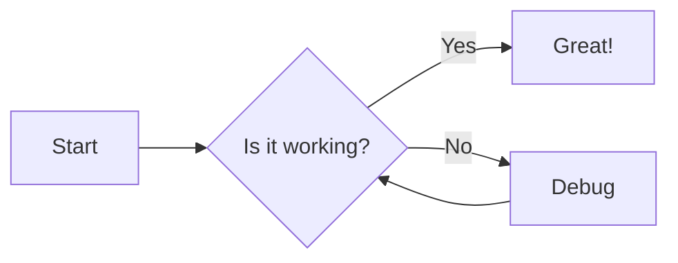
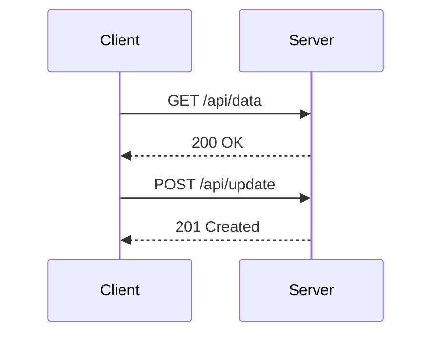

# Mermaid Rendering E2E Fixture

This lesson is used by automated e2e tests for mermaid diagram rendering. Do not edit manually.

## Flowchart



## Sequence Diagram



## Regular Code Block

This block should render as syntax-highlighted code, not through mermaid.

```javascript
const x = 42;
console.log(x);
```
